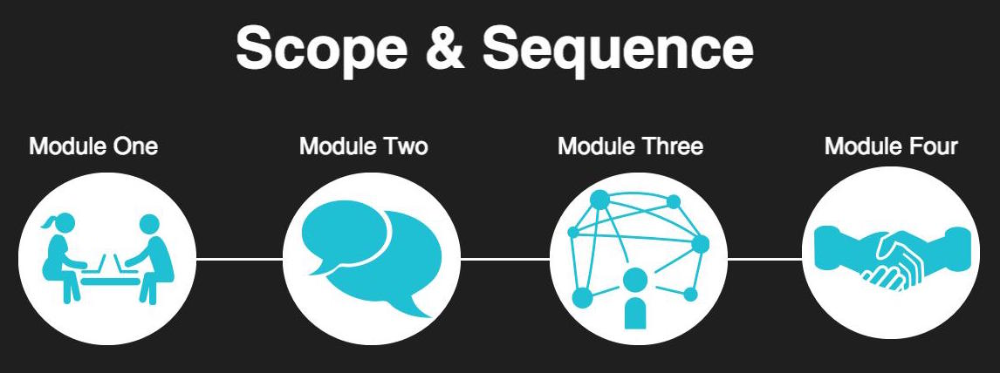

# Career Development Curriculum

Turing’s mission is to unlock human potential by training a diverse, inclusive student body to succeed in high-fulfillment technical careers. Turing’s professional development curriculum is created directly out of this mission with a focus on unlocking students’ potential in modules one and two through cultivating self-awareness and empathy. In modules three and four, curriculum focuses on providing strategies to empower students to succeed in high-fulfillment technical careers by creating connections within the technology industry, building competencies for industry leadership, and securing a fulfilling career -- and not just another job. 

The touchstones of this curriculum include these mindsets: 

* Agency: Taking initiative and ownership over your learning and work
* Empathy: Understanding and sharing others' emotions in order to relate to them 
* Engagement: Active participation in community
* Grit: A combination of perseverance and passion
* Growth: A belief that your abilities can be developed through dedication, hard work, and resiliency

Through this development, upon graduation, students will be able to communicate who they are and what they know, collaborate with teams, adapt to changing situations, execute their ideas, and solve problems as junior software developers. 

In this repo, you'll find all of the curriculum for ....

### Module One

## Placeholder:
Sessions are listed in the order they will happen in the module

Module One:

* StrengthsFinder Intro (March)
* Gear Up 1: Growth Mindset (March)
* Gear Up 2: Getting Better at Difficult Things (March)
* Learning to Pair (March)
* Optional: Stress Management spike (March)
* Gear Up 3: Dealing with Difference: Introvert vs. Extrovert (March)
* Feedback I (March)
* Gear Up 4: Storytelling & Strengths (StrengthsFinder I) (March)
* Optional: Stress Management spike (March)
* Branding (March)
* Gear Up 5: Code: Debugging the Gender Gap (March)

Module Two:

* BEE: Collaboration (March)
* Cold Outreach I (March)
* Gear Up 1: Empathy (cohort-specific) (March)
* Feedback II (March)
* Crucial Conversations/Microaggressions Follow-Up (pending) (March)
* FEE: Project Management/Collaborating (March)
* Gear Up 2: Parable of the Polygon/Automation (March)
* Feedback III (March)
* StrengthsFinder: Teamwork (March; full class session May)
* Gear Up 3: Case Study (March)

Module Three:

* Flower Exercise **(May)**
* Gear Up 1: Citizenship (March)
* Resume/Portfolio - incorporate StrengthsFinder here around professional storytelling/intro to ReadMes **(Focus on resume will start in May; SF will apply in June)**
* Finding Opportunities (March)
* Gear Up 2: Parable of the Polygon/Automation (March)
* Interview Prep I (March)
* Job Search Strategies I (March)
* Gear Up 3: Case Study (March)
 
Module Four:

* Cold Outreach II (also focused on capitalizing on your network) **(Quick follow-up in March; full session in May)**
* Gear Up 1: Case Study planning I (March)
* Interview Prep II (practice) (March)
* Gear Up 2: Case Study planning II (March)
* Negotiations (March)
* Job Search Strategies II/StrengthsFinder: Envisioning the future (working on revised version of the Plan) **(SF will apply in August)**
* Gear Up 3: Case Study (March)
* Optional workshops led by Meg, 2-3 per mod (March)
