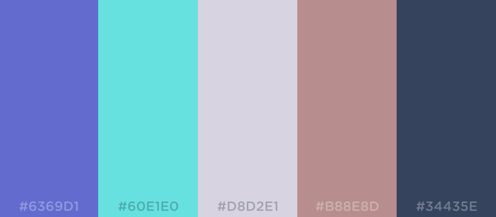

## Learning Goals

* Explain why SASS is a better option than raw CSS
* Be able to set up SASS in a Rails project
* Understand how to create variables in SASS
* Understand how to nest elements in SASS
* Understand how to nest properties in SASS

## Vocabulary

* SASS
* `.scss`
* Variables in SASS
* Nesting Elements
* Nesting Properties

## CSS Selector Refresh

```css
#id-name {
  /*targets elements with id="id-name"*/
}

.class-name {
  /*targets elements with class="class-name"*/
}

.class-name.second-class {
  /*targets elements with class="class-name second-class"*/
}

.class-name p {
  /*targets all paragraph child elements of class="class-name"*/
}

.class-name > p {
  /*targets only paragraph elements that are direct children of class="class-name"*/
}
```

## What is SASS?

Syntactically Awesome StyleSheets! An extension of CSS that allows us to use raw CSS syntax while also mixing in variables, functions, and modularity where we please. It is a style sheet language that get compiled or interpreted as CSS. Plain CSS is valid SASS. It is coded in Ruby :boom:!

### WHY THO??

SASS has a lot of awesome features that help organize our CSS files. Let's explore some of those features.

We are going to work in `movie_mania` for this exercise.

First, let's get some data in our database.   

Copy [this](https://docs.google.com/spreadsheets/d/1z3riNNOpyVMOEeqjOEma5tq2xr7S8DysHYgbw0057sg/edit?usp=sharing) spreadsheet and put it in the `movie_mania` project under `data/movies.csv`. Let's also merge in the `seed` branch that has the code to import the `movies.csv`. Run `rake db:seed` to seed the database with movies.

We are going to be working in `view/movies/index.html.erb`

## SCSS Setup in Rails

[`sass-rails`](https://github.com/rails/sass-rails) ships with Rails 5 projects. If you need to add it manually:

```ruby
# Gemfile
gem 'sass-rails'
```

This should provide for you an `application.scss` within `app/assets/stylesheets` or you will want to change the name of the `application.css` file to `application.scss`

Lets also create a `custom.scss` file to write our new code in.

But where in our app is are the stylesheets even linked?!?

Check out the file `app/views/application.html.erb` to see where we are linking the stylesheets and how (hint: it's a rails helper!)

## Variables in SASS

Variables in SASS are declared with a `$` and are assigned with a colon `:`



We have chosen a color palette for our app, let's create some variables with those hex codes. Our app is pretty small right now so keeping track of colors is simple but image as our app grows and we have to continually look back for our hex codes. By creating variables, we can easily access these colors at any point.

```Sass
$light-purple: #E8E1EF;
$ice-blue: #D9FFF8;
$wow-green: #C7FFDA;
$mellow-green: #C4F4C7;
$forest-green: #9BB291;
```
Lets go ahead and set all text color of all our `<h1>`'s to `$mellow-green` and our `<h2>` to `$forest-green`

```SASS
  h1 {
    color: $mellow-green;
  }

  h2 {
    color: $forest-green;
  }
```

What if we just want the `<h1>` on the `movies#index` to be `$mellow-green` but other `h1`'s to be `$light-purple`?

## Nesting - Elements

First, let's add some structure to our `index`.

```html
<div class="movie-index">
  <h1>All Movies</h1>
  <% @movies.each do |movie| %>
    <h2><%= movie.title %></h2>
    <p><%= movie.description %></p>
  <% end %>
</div>
```

Then we can NEST our html elements. This provides more readable code and an actual STRUCTURE for our CSS. FINALLY!!!

```SASS
  h1 {
    color: $mellow-green;
  }

  .movie-index {
    h1 {
      color: $light-purple;
    }
  }
```

Run `rails s` and visit the route `/movies` to see the CSS. Inspect the CSS and see that it compiles as we expect to see CSS code! COOL!

On your own: Create a variable that holds a `$wow-green` 3px dotted border and add it to both the `<p>` tag and the `<h2>`.

## Nesting - Properties

Another great benefit of SASS is that we can nest our properties for more clarification and organization.

Let's center our `<h2>` and underline the text.

```SASS
  .movie-index {
    h2 {
      text: {
        align: center;
        decoration: underline;
      }
    }
  }
```

On your own, add a font family of `papyrus` and a size of 15px to the `<p>` tag under `.movie-index`

## Wrap Up Questions

* What does SASS stand for?
* Why is SASS a better option than CSS?
* How is a variable declared and assigned in SASS?
* Why is nesting a benefit? Both at a element and property level?

### Resources

* Read the [Sass docs](http://sass-lang.com/guide) :D
