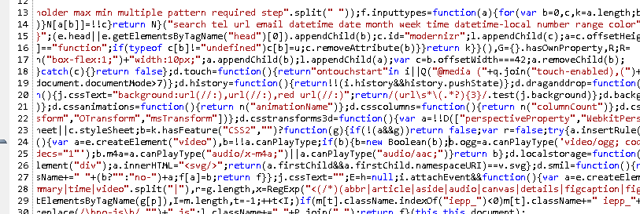
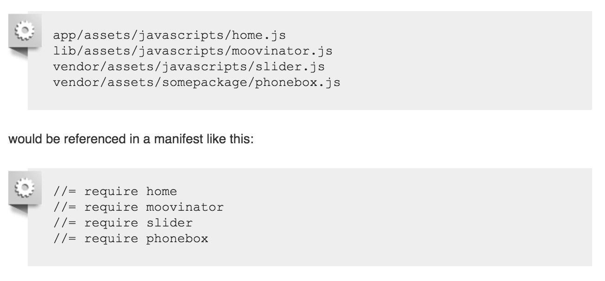

# Intro to the Asset Pipeline

---

# Warmup

* What do you already know about the asset pipeline?
* What have you heard?

---

# Learning Goals

* Explain the purpose of the asset pipeline
* Explore Heroku
* Run your app in the production environment locally

---

# What Are Assets

* Javascripts
* CSS files
* Images

---

# Where Do Assets Live?

* `app/assets`: assets owned by the application; includes custom CSS, JS files, and images
* `lib/assets`: assets you created, but aren't necessarily specific to your application
* `vendor/assets`: assets created by third-parties.

note: the files in app/assets are never served directly in production.
note: assets in lib/assets and vendor/assets will not automatically be included in the precompile process

---

# The Asset Pipeline

* Sprockets gem, enabled by default
* Asset loading is expensive
* Faster asset loading = faster performance
* Framework to concatenate, minify, and preprocess JS, and CSS files
* Depends on gems: sass-rails, uglifier, coffee-rails

---

# Asset Pipeline Scavenger Hunt

---

# What Does Minified CSS Look Like?


---

# What Does Minified JS Look Like?



---

# Duties of the Asset Pipeline

  * Precompiling higher-level languages - Sass for CSS, CoffeeScript for JavaScript
  * Concatenating assets - one master .js file and one master .css file which reduces the number of requests a browser makes in order to render our web page
  * Minifying files - removes whitespace, comments, and shortens variable names

---

# Manifest Files

  * `app/assets/javascripts/application.js`
  * `app/assets/stylesheets/application.css`

---

# Directives in Manifest Files

  * Processed top-to-bottom
  * `require_tree .` recursively requires all files within app/assets
  * Files required in the manifest can live in app/assets, lib/assets, or vendor/assets

---

# Directives in Manifest Files



---

# How Does Your App Know About the Master JS and CSS File?

In app/views/layouts/application.html.erb:

```erb
<%= stylesheet_link_tag "application", media: "all" %>
<%= javascript_include_tag "application" %>
```

---

# Heroku

* When should you push to heroku?
* Who should push to heroku?
* Adding a collaborator: don't clone the app from Heroku!
* Add the Heroku remote instead (`heroku git:remote -a app_name`)

---

# Do you need to keep the strange name that is automatically created for you?

`https://enigmatic-lowlands-98091.herokuapp.com/`

---

# Master

* Heroku likes your master branch
* If you don't want to push master, you need to do `git push heroku your-branch-name:master`

---

# Databases

* Will need to migrate/seed on heroku
* Unable to create/drop on heroku
* Instead, you can `heroku pg:reset DATABASE` if you need
* Don't get too comfortable dropping your production database!

---

# What about your assets?!?

* Heroku precompiles your assets automatically
* Precompiled assets receive a 'fingerprint' to override caching strategies when they change
* In order to access your some assets you'll need to use helpers to access the fingerprinted version of the asset that's being served

---

# Debugging

* `heroku logs`
* `heroku logs --tail`
* `rails_12factor` - in production for earlier versions of rails

---

# Running Your App in Production Locally

---

# Set `SECRET_KEY_BASE`

* `rake secret`
* `export "SECRET_KEY_BASE"="long_string"`

---

# Adjust `production.rb`

In `config/environments/production.rb`

* `config.consider_all_requests_local = true`
* Comment out the following:

```
  config.public_file_server.enabled = ENV['RAILS_SERVE_STATIC_FILES'].present?
```

* Copy and paste that line and set that variable to `true`, e.g.:

```
  config.public_file_server.enabled = true
```

---

# Load DB

* `create_user -s -r app_name`
* `RAILS_ENV=production rake db:create db:migrate db:seed`

---

# Precompile Assets

* `rake assets:precompile`

---

# Run Server

* `rails s -e production`

---

# Clobber

* `rake assets:clobber`
* Undo changes to `config/environments/production.rb`

---

# Running Production Challenge

